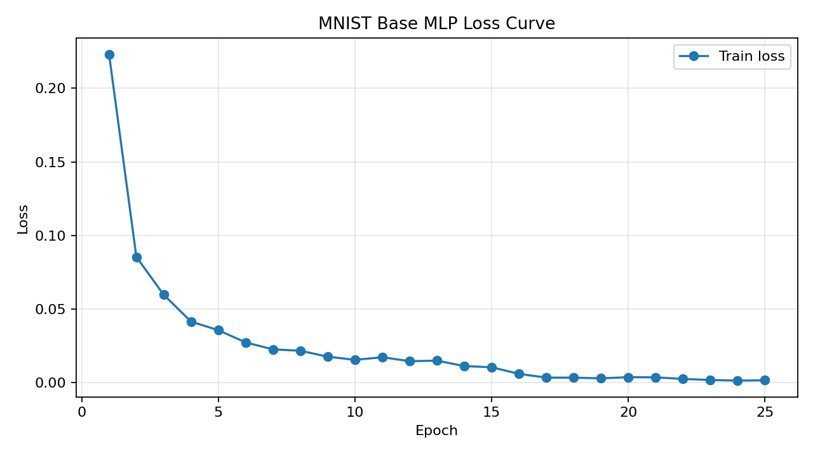
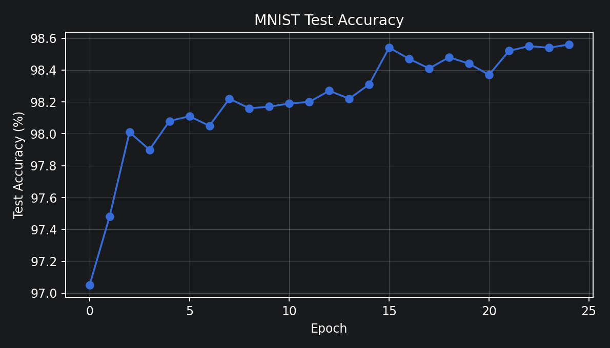
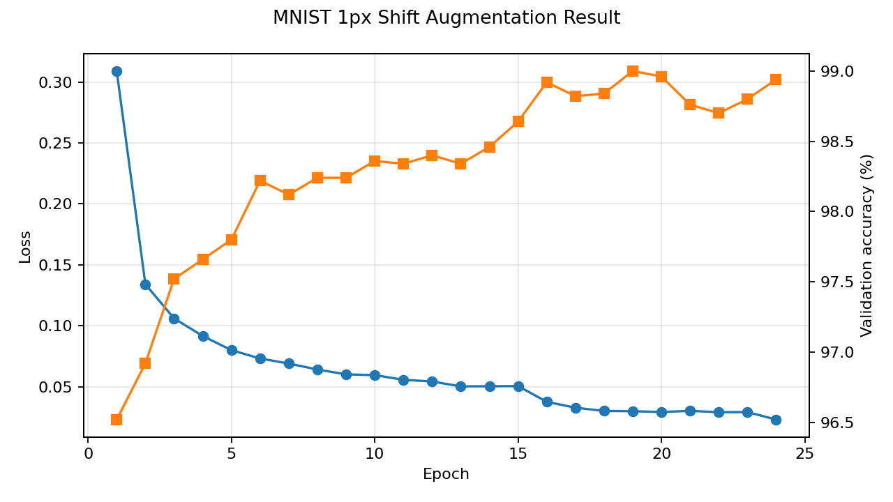
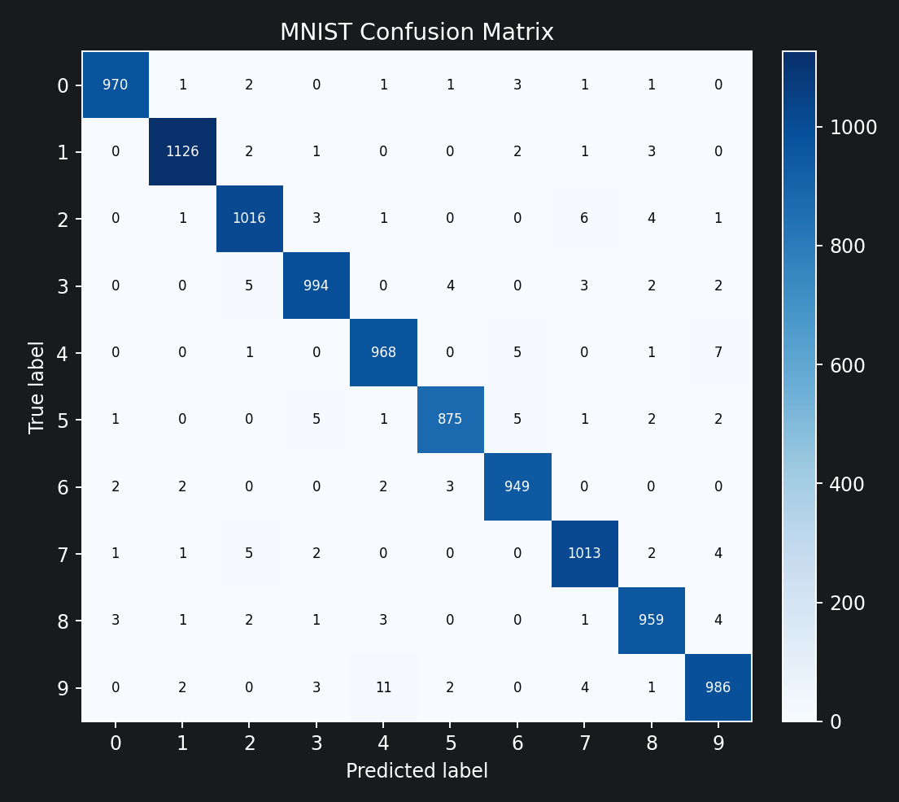

# MNIST Handwritten Digit Recognition Report

## 0. 반·팀원

| 항목 | 내용 |
| --- | --- |
| 반 | TODO |
| 팀명 | TODO |
| 팀원 | TODO |

## 1. 실험 목적

본 과제의 목적은 PyTorch, TensorFlow 같은 딥러닝 프레임워크 없이 NumPy만 사용해 MNIST 손글씨 숫자 분류기를 구현하는 것이다.

구현 과정에서 단순히 정확도를 높이는 것보다, 다음 학습 흐름을 직접 구현하고 설명할 수 있는지를 중점으로 두었다.

```text
Forward -> Loss -> Backward -> Optimizer Update
```

최종 목표는 MNIST 테스트 정확도 95% 이상, 권장 97% 이상을 달성하는 것이다.

## 2. 모델 구조

주 제출 모델은 완전연결 다층 퍼셉트론(MLP) 구조를 사용하였다.

```text
Input: 784
-> Affine(512)
-> BatchNorm
-> ReLU
-> Dropout
-> Affine(256)
-> BatchNorm
-> ReLU
-> Dropout
-> Affine(10)
-> Softmax
```

| 구성 요소 | 내용 |
| --- | --- |
| 입력층 | 28x28 이미지를 펼친 784차원 벡터 |
| 은닉층 | 512, 256 |
| 출력층 | 10개 클래스 |
| 활성화 함수 | ReLU |
| 출력 함수 | Softmax |
| 정규화 | BatchNorm |
| 규제 | Dropout |
| 초기화 | 은닉층 He 초기화, 출력층 Xavier 계열 초기화 |

위 표는 모델을 구성하는 주요 부품과 각 부품의 역할을 정리한 것이다. 입력층은 28x28 이미지를 784개의 숫자로 받아들이고, 은닉층은 그 숫자 조합에서 특징을 뽑는다. 마지막 출력층은 0부터 9까지 10개 숫자에 대한 점수를 만들고, Softmax를 통해 각 숫자일 확률로 변환한다.

추가 실험에서는 같은 MLP 구조에 학습 중 1픽셀 랜덤 shift augmentation을 적용하였다.

## 3. 학습 설정

주 제출 모델 설정은 다음과 같다.

| 항목 | 값 |
| --- | --- |
| Optimizer | Adam |
| 초기 learning rate | 0.001 |
| learning rate schedule | epoch 16: 0.0005, epoch 22: 0.0002 |
| epochs | 25 |
| batch size | 128 |
| Dropout ratio | 0.1 |
| BatchNorm momentum | 0.9 |
| loss | Cross Entropy |

이 표는 주 제출 모델을 다시 학습할 때 필요한 설정값을 정리한 것이다. Adam optimizer는 각 파라미터마다 학습 속도를 조절해 주는 방식이고, learning rate schedule은 후반 epoch에서 학습률을 낮춰 모델이 더 안정적으로 수렴하도록 넣었다. batch size는 한 번의 update에 사용하는 이미지 수를 뜻한다.

추가 실험의 최고 기록은 다음 조건에서 나왔다.

| 항목 | 값 |
| --- | --- |
| Augmentation | train batch마다 1픽셀 랜덤 shift |
| Dropout ratio | 0.1 |
| Weight decay | 5e-5 |
| best epoch | 19 |
| validation 기준 선택 | 사용 |

이 표는 가장 높은 정확도를 얻은 추가 실험 조건을 정리한 것이다. 여기서 validation 기준 선택을 사용했다는 것은 test set을 직접 보며 최고점을 고른 것이 아니라, train data에서 따로 떼어 둔 validation set의 성능이 가장 좋았던 epoch를 선택했다는 뜻이다.

## 4. 실험 환경

| 항목 | 내용 |
| --- | --- |
| 실행 환경 | 로컬 Windows |
| Python | 3.11.9 |
| NumPy | 2.4.6 |
| Matplotlib | 사용 |
| pytest | 사용 |
| GPU | MNIST 구현은 NumPy 기반이라 CUDA/GPU 사용 없음 |

이 표는 실험이 실행된 환경을 정리한 것이다. 이번 과제는 딥러닝 프레임워크를 쓰지 않고 NumPy 연산으로 구현했기 때문에, RTX 5090이 장착된 로컬 환경이더라도 MNIST 학습 자체는 GPU가 아니라 CPU 중심으로 실행되었다.

대표 실행 시간:

| 실험 | 시간 |
| --- | --- |
| 기본 15 epoch 전체 학습 | 약 68.87초 |
| 25 epoch 병렬 sweep 중 최고 후보 | 약 543.84초 |
| augmentation 포함 추가 실험 최고 후보 | 약 2546.0초 |

이 표는 주요 실험이 끝나기까지 걸린 시간을 비교한 것이다. augmentation 실험은 Python/NumPy에서 이미지 이동을 batch마다 처리했기 때문에 기본 학습보다 시간이 크게 증가하였다.

## 5. 결과

### 5.1 단위 테스트

전체 테스트를 실행하였다.

```bash
python -m pytest tests/ -v
```

결과:

```text
21 passed
```

### 5.2 주 제출 모델 결과

템플릿 `src/` 기준으로 재현 가능한 주 제출 모델 결과는 다음과 같다.

| 항목 | 값 |
| --- | --- |
| 모델 | 784 -> 512 -> 256 -> 10 |
| BatchNorm | 사용 |
| Dropout | 0.1 |
| test accuracy | 98.73% |
| best epoch | 24 |
| final accuracy | 98.68% |
| final train loss | 0.001453 |
| 총 파라미터 수 | 537,354 |

이 표는 주 제출 모델의 최종 성능을 정리한 것이다. test accuracy는 학습에 사용하지 않은 test set에서 맞힌 비율이고, final train loss는 마지막 epoch에서 학습 데이터에 대해 계산한 오차이다. 총 파라미터 수는 모델 안에서 학습되는 weight, bias, BatchNorm 파라미터를 모두 합친 값이다.

Loss curve:



이 그래프는 x축을 epoch, y축을 train loss로 두고 학습 오차의 변화를 나타낸 것이다. 학습이 진행될수록 loss가 꾸준히 감소했다. 초반 epoch에서 loss가 크게 떨어진 것은 모델이 숫자의 기본적인 패턴을 빠르게 학습했다는 의미로 볼 수 있다. 후반으로 갈수록 loss가 거의 0에 가까워졌기 때문에, train data에는 충분히 잘 맞고 있다고 판단했다. 다만 train loss만 보면 과대적합 여부를 알기 어렵기 때문에 test accuracy와 함께 확인했다.

Accuracy curve:



이 그래프는 x축을 epoch, y축을 test accuracy로 두고 평가 정확도의 변화를 나타낸 것이다. 정확도는 초반에 빠르게 올라간 뒤, 중반 이후에는 98%대에서 천천히 개선되었다. loss는 계속 줄어들었지만 accuracy가 매 epoch마다 항상 오르지는 않았다. 이미 대부분의 샘플을 맞히는 상태에서는 남은 어려운 샘플 몇 개가 전체 정확도를 좌우하기 때문에, loss 감소와 accuracy 상승이 완전히 같은 모양으로 움직이지는 않았다.

### 5.3 추가 실험 결과

1픽셀 랜덤 shift augmentation을 적용한 실험에서는 더 높은 정확도를 얻었다.

| 항목 | 값 |
| --- | --- |
| 모델 | 784 -> 512 -> 256 -> 10 |
| BatchNorm | 사용 |
| Dropout | 0.1 |
| Augmentation | 1픽셀 랜덤 shift |
| Weight decay | 5e-5 |
| best validation accuracy | 99.00% |
| test accuracy at best validation | 99.08% |
| best epoch | 19 |
| 총 파라미터 수 | 537,354 |

이 표는 augmentation을 적용한 최고 실험 결과를 정리한 것이다. best validation accuracy는 validation set에서 가장 높게 나온 정확도이고, test accuracy at best validation은 그 epoch의 모델을 test set에서 한 번 평가한 값이다.

Augmentation 실험 곡선:



이 그래프는 augmentation 실험에서 epoch에 따라 train loss와 validation accuracy가 어떻게 변했는지 보여준다. 1픽셀 랜덤 shift augmentation을 적용하자 학습 시간은 늘어났지만 validation accuracy가 더 높게 나왔다. 학습 과정에서 매번 조금씩 이동된 이미지를 보게 되므로, 숫자가 살짝 밀려 있어도 같은 숫자로 인식하는 능력이 좋아진 것으로 해석했다. 또한 validation accuracy가 가장 높은 epoch를 기준으로 test를 확인했기 때문에, test set을 직접 보면서 epoch를 고르는 방식보다 더 안전한 평가라고 볼 수 있다.

### 5.4 신뢰도 보조 지표

아래 지표는 train 55,000개와 validation 5,000개로 나눈 뒤, validation accuracy가 가장 높은 epoch의 모델을 test set에서 평가한 결과이다. 최고 기록을 다시 갱신하기 위한 지표라기보다, 모델이 어떤 숫자를 헷갈리는지 확인하기 위한 보조 평가로 사용하였다.

| 항목 | 값 |
| --- | --- |
| best epoch | 23 |
| best validation accuracy | 98.26% |
| test accuracy at best validation | 98.43% |
| macro precision | 98.43% |
| macro recall | 98.41% |
| macro F1 | 98.42% |

이 표는 단순 accuracy 외에 모델의 분류 성능을 다른 기준으로 확인한 것이다. macro precision, macro recall, macro F1은 숫자 0~9 각각의 지표를 계산한 뒤 평균낸 값이다. 특정 숫자 하나에만 성능이 치우쳐 있는지 확인하기 위해 추가하였다.

Confusion Matrix:



이 그림은 실제 정답과 모델의 예측이 어떻게 대응되는지 보여준다. 세로축은 실제 숫자, 가로축은 모델이 예측한 숫자이다. 대각선 값은 정답을 맞힌 개수이고, 대각선 밖의 값은 다른 숫자로 헷갈린 개수이다. 대부분의 값이 대각선에 몰려 있어 전체적으로는 잘 분류하고 있다. 상대적으로 많이 헷갈린 경우는 `4 -> 9`, `5 -> 3`, `7 -> 2`, `9 -> 3/4`처럼 모양이 비슷하거나 손글씨에 따라 획이 겹쳐 보일 수 있는 숫자들이었다.

Class-wise Precision / Recall / F1:

| 숫자 | Precision | Recall | F1 | Support |
| --- | ---: | ---: | ---: | ---: |
| 0 | 98.38% | 98.88% | 98.63% | 980 |
| 1 | 99.21% | 99.21% | 99.21% | 1,135 |
| 2 | 98.45% | 98.55% | 98.50% | 1,032 |
| 3 | 97.84% | 98.51% | 98.17% | 1,010 |
| 4 | 98.87% | 97.86% | 98.36% | 982 |
| 5 | 99.09% | 97.76% | 98.42% | 892 |
| 6 | 98.23% | 98.75% | 98.49% | 958 |
| 7 | 98.35% | 98.44% | 98.40% | 1,028 |
| 8 | 98.06% | 98.46% | 98.26% | 974 |
| 9 | 97.82% | 97.72% | 97.77% | 1,009 |

이 표는 숫자별 precision, recall, F1을 따로 계산한 결과이다. Precision은 모델이 어떤 숫자라고 예측한 것 중 실제로 맞은 비율이고, recall은 실제 그 숫자인 샘플 중 모델이 맞힌 비율이다. F1은 precision과 recall을 함께 반영한 값이며, support는 test set에 들어 있는 해당 숫자의 개수이다. MNIST는 클래스가 비교적 균형 잡힌 데이터라 accuracy만으로도 큰 문제는 없지만, precision/recall/F1을 보면 숫자별 약점이 더 잘 보인다. 예를 들어 9는 F1이 가장 낮은 편인데, confusion matrix에서도 4나 3과 헷갈리는 경우가 보였다. 반대로 1은 획이 단순하고 다른 숫자와 구분이 쉬워 precision과 recall이 모두 높게 나왔다.

Seed별 반복 실험:

같은 기본 모델 설정에서 validation split은 고정하고, weight initialization과 mini-batch shuffle에 영향을 주는 seed만 바꿔 3회 반복하였다.

| seed | best epoch | best validation accuracy | test accuracy at best validation | macro F1 |
| ---: | ---: | ---: | ---: | ---: |
| 42 | 23 | 98.26% | 98.43% | 98.42% |
| 43 | 25 | 98.26% | 98.60% | 98.60% |
| 44 | 23 | 98.20% | 98.47% | 98.46% |
| 평균 ± 표준편차 | - | 98.24% ± 0.03%p | 98.50% ± 0.09%p | 98.49% ± 0.09%p |

이 표는 seed가 달라졌을 때 결과가 얼마나 흔들리는지 확인하기 위한 것이다. seed가 달라지면 weight initialization과 mini-batch shuffle 순서가 달라지므로 최종 성능이 조금씩 달라질 수 있다. 이번 실험에서는 test accuracy의 표준편차가 약 0.09%p로 작았다. 즉, 이번 모델의 성능은 특정 seed에서 우연히 한 번 잘 나온 결과라기보다, 비슷한 조건에서 비교적 안정적으로 재현되는 결과라고 볼 수 있다.

## 6. 회고

학습 손실은 epoch가 진행될수록 안정적으로 감소하였다. 기본 MLP 모델만으로도 권장 목표인 97%를 넘겨 98.73%를 달성하였다.

정확도 향상에 가장 효과적이었던 시도는 모델을 무작정 키우는 것이 아니라, Dropout 비율을 0.2에서 0.1로 낮추고 learning rate decay를 적용한 것이었다. 더 넓거나 깊은 MLP는 파라미터 수가 늘었지만 정확도 향상은 크지 않았다.

추가 실험에서 1픽셀 랜덤 shift augmentation을 적용하자 99.08%까지 정확도가 올라갔다. 이는 MNIST 숫자가 약간 이동해도 같은 숫자라는 성질을 모델이 더 잘 학습했기 때문으로 해석된다.

과대적합 관점에서는 test set을 반복해서 보는 방식이 바람직하지 않으므로, 추가 실험에서는 train 데이터 일부를 validation set으로 분리하고 validation accuracy가 가장 높은 시점의 모델을 test set에서 확인하였다.

이번 과제를 통해 Forward, Loss, Backward, Optimizer Update가 각각 따로 존재하는 함수가 아니라 하나의 학습 루프로 연결된다는 점을 확인하였다. 특히 BatchNorm과 Dropout은 train/test 모드에서 동작이 달라지므로, 평가 시 `train=False`로 전환하는 것이 중요했다.

향후 개선 방향으로는 CNN 구조를 직접 구현하는 방법이 있다. 참고 논문에서는 Convolution, Max Pooling, BatchNorm을 결합한 간단한 CNN으로 99.22%를 보고하였다. 다만 이번 과제의 기본 TODO 범위는 MLP 구현이므로, CNN은 추가 확장 과제로 보는 것이 적절하다.
